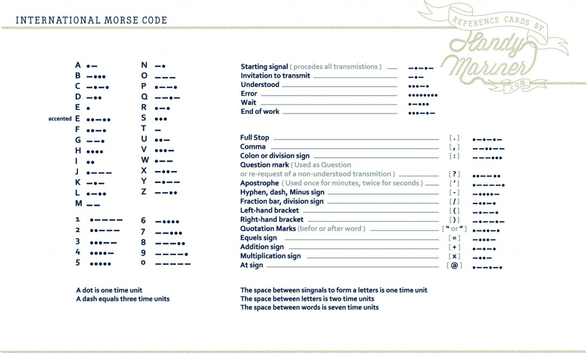

# Morse Code Modulator Demodulator


Image-Source: http://www.handymariner.com/morse-code/

### 4 elements to Morse Code that you’ll need to form a sentence.
1. **DOT** – one time unit long
2. **DASH** – three time units long
3. **BETWEEN LETTERS** – pause for three time units
4. **BETWEEN WORDS** – pause for seven time units

> **One time unit taken in code is 100ms**

## Using Source Code

Simply create object of `Modem` class. It has 2 methods, one is `ConvertToMorseCode` which takes message string as parameter and returns generated Morse Code as string. other method is `PlayMorseCode` which play morse code using `Console.Beep` it takes one string parameter which can be a simple message string or valid Morse Code, If morse code is not valid or it's a string then it calls `ConvertToMorseCode` internally. So it is suggested to pass valid morse code converted by `ConvertToMorseCode` rather than passing a string.

Have a look at `Program.cs` for example. 

```csharp
var modem = new Modem();
var message = "Hello, I am AshV";

// Converting to Morse Code
var morseCode = modem.ConvertToMorseCode(message);

WriteLine($"Morse Code for Sentence : {message}");
WriteLine(morseCode);

// Morse Code can be played with generated morse code
WriteLine("Playing from Morse Code.");
modem.PlayMorseTone(morseCode);

// or Can be direactly played by passing sentence
WriteLine("Playing from Message.");
modem.PlayMorseTone(message);
```

Image Ref: http://www.handymariner.com/morse-code/